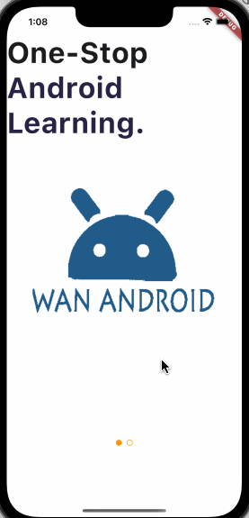

# flutter_wanandroid2

基于clean architecture的又一个flutter 玩安卓客户端。因为前面有个采用多package架构，开发了一半的flutter_wanandroid。
感觉每个包要安装大量的重复依赖，彼此间又经常发生依赖，感觉这个架构不适合当前的项目，于是改用clean architecture重新实现了一个版本。

## 开始
本项目采用riverpod进行状态管理。分别采用了推荐的AsyncData和自定义State两种实现方式，分别对应带异常抛出和异常封装。

## 遇到的问题
1.Android打包相关
1.1 kotlin版本过低
1.2 flutter默认Android工程设置不支持MultiDex
1.3 firebase配置问题：Failed to load FirebaseOptions from resource. Check that you have defined values.xml
1.4 firebase cli登录失败
1.5 修改安卓包名导致 Didn't find class .MainActivity on path DexPathList
1.6 登录注册页面因键盘导致的布局溢出问题

## 截图

